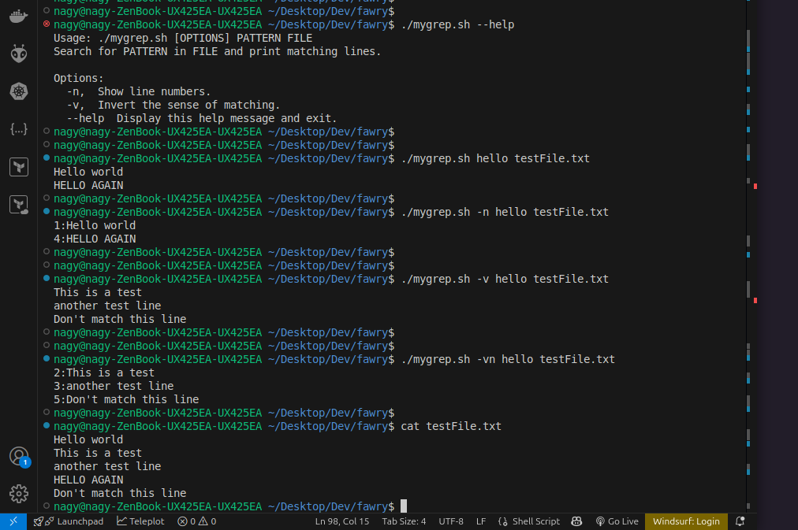

# Q1: mygrep.sh - Mini Grep Utility

## Objective
Create a lightweight bash-based grep alternative with basic search functionality.

## Features
- Case-insensitive search
- Line number display
- Invert match option
- Error handling

## Script Implementation

```bash
#!/bin/bash

usage() {
    echo "Usage: $0 [OPTIONS] PATTERN FILE"
    echo "Search for PATTERN in FILE and print matching lines."
    echo
    echo "Options:"
    echo "  -n,  Show line numbers."
    echo "  -v,  Invert the sense of matching."
    echo "  --help  Display this help message and exit."
    exit 1
}

ShowLineNumbers=false
InvertMatch=false

# Option parsing function to handle combined options
process_option() {
    local opts="$1"
    for ((i=0; i<${#opts}; i++)); do
        case "${opts:$i:1}" in
            n) ShowLineNumbers=true ;;
            v) InvertMatch=true ;;
            *)
                echo "Error: Invalid Option: -${opts:$i:1}"
                usage
                ;;
        esac
    done
}

# Option parsing
while [[ $# -gt 0 ]]; do
    case "$1" in
        -[nv]*)
            process_option "${1#-}"
            shift
            ;;
        -n)
            ShowLineNumbers=true
            shift
            ;;
        -v)
            InvertMatch=true
            shift
            ;;
        --help)
            usage
            ;;
        -*)
            echo "Error: Invalid Option: $1"
            usage
            ;;
        *)
            if [[ -z "$pattern" ]]; then
                pattern="$1"
            else
                file="$1"
            fi
            shift
            ;;
    esac
done

# Input validation
if [[ -z "$pattern" || -z "$file" ]]; then
    echo "Error: Missing PATTERN or FILE."
    usage
fi

if [[ ! -f "$file" ]]; then
    echo "Error: File not found: $file"
    exit 1
fi        

# Main search logic
line_number=0
while IFS= read -r line; do
    ((line_number++))
    
    if [[ $InvertMatch == false ]] && echo "$line" | grep -qiE "$pattern"; then
        if [[ $ShowLineNumbers == true ]]; then
            echo "$line_number:$line"
        else
            echo "$line"
        fi
    elif [[ $InvertMatch == true ]] && ! echo "$line" | grep -qiE "$pattern"; then
        if [[ $ShowLineNumbers == true ]]; then
            echo "$line_number:$line"
        else
            echo "$line"
        fi
    fi
done < "$file"
```

## Usage Examples

### Basic Search

```bash
# Search for 'hello' (case-insensitive)
./mygrep.sh hello testFile.txt
# Output: Hello world, HELLO AGAIN

# Search with line numbers
./mygrep.sh -n hello testFile.txt
# Output: 1:Hello world, 4:HELLO AGAIN

# Invert match
./mygrep.sh -v hello testFile.txt
# Output: Lines not containing 'hello'

# Invert match with line numbers
./mygrep.sh -vn hello testFile.txt
# Output: Numbered lines not containing 'hello'
```


### Installation
```bash
# Make script executable
chmod +x mygrep.sh
```

## Key Features
- Case-insensitive matching
- Optional line numbering
- Invert match functionality
- Minimal error handling

## Limitations
- No regex support
- Basic pattern matching only

## Potential Improvements
- Add regex support
- More advanced option parsing
- Enhanced error reporting


## Output Screen



# Q2: Internal Web Dashboard Connectivity Troubleshooting Guide

## Comprehensive Troubleshooting Workflow

### 1. DNS Resolution Verification
```bash
# Check local DNS servers
cat /etc/resolv.conf

# Test DNS resolution using local nameservers
nslookup internal.example.com

# Test DNS resolution using Google DNS
nslookup internal.example.com 8.8.8.8
```

### 2. Network Connectivity Diagnostics
```bash
# Trace DNS resolution path
tracepath internal.example.com

# Ping to verify basic network connectivity
ping -c 4 internal.example.com

# Check network interfaces
ip addr
ifconfig

# Verify routing table
ip route
```

### 3. Service Reachability Tests
```bash
# Test web service connectivity
curl http://internal.example.com
telnet internal.example.com 80
telnet internal.example.com 443

# Check open ports
sudo netstat -tuln | grep -E '80|443'
sudo ss -tuln | grep -E '80|443'
```

## Potential Issue Categories

### DNS-Related Issues

1. Incorrect DNS Configuration
```bash
# Manually edit DNS servers
sudo nano /etc/resolv.conf
```

2. DNS Caching Problems

```bash
# Flush DNS cache
sudo systemd-resolve --flush-caches
sudo resolvectl flush-caches
```

### Network Configuration Issues
1. Firewall Blocking
```bash
# Check firewall status
sudo ufw status
sudo firewall-cmd --list-all

# Temporarily disable firewall for testing
sudo ufw disable
sudo systemctl stop firewalld
```

2. Routing Problems
```bash
# Check routing table
ip route

# Add static route if needed
sudo ip route add default via <gateway-ip>
```
 
### Service-Level Issues

1. Service Not Running
```bash
# Check service status
systemctl status nginx
systemctl status apache2

# Restart web service
sudo systemctl restart nginx
```

2. Misconfigured Virtual Hosts
```bash
# Check web server configuration
sudo nginx -t
sudo apachectl configtest
```


## Bonus: Local DNS Override

### Temporary Local Testing
```bash
# Edit hosts file to bypass DNS
sudo nano /etc/hosts

# Add entry
192.168.1.100 internal.example.com
```

### Persistent DNS Configuration
```bash
# Using systemd-resolved
sudo systemd-resolve --interface=eth0 --set-dns=8.8.8.8

# Using NetworkManager
nmcli con mod "your-connection" ipv4.dns "8.8.8.8"
nmcli con up "your-connection"
```

